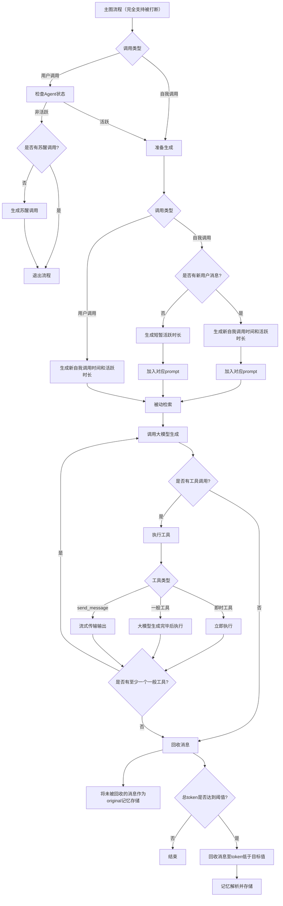
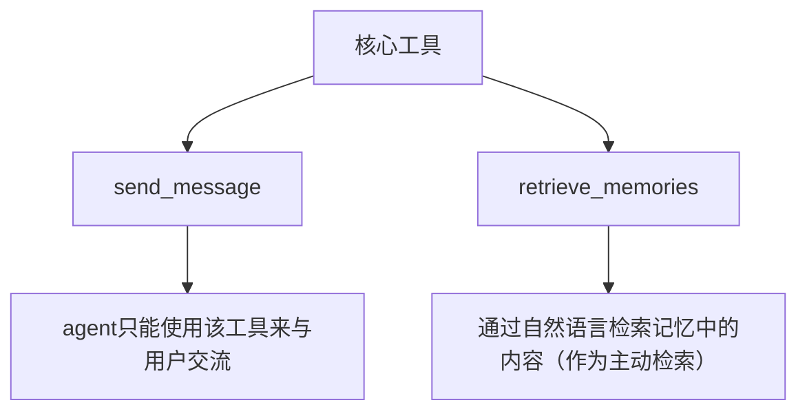
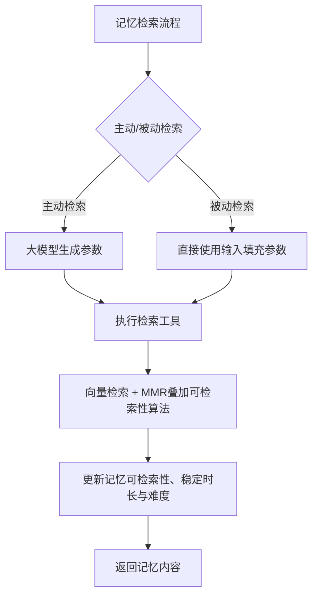
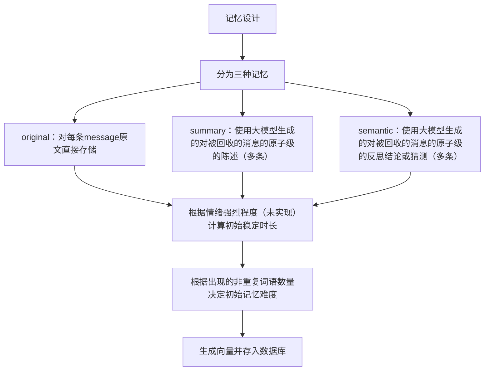
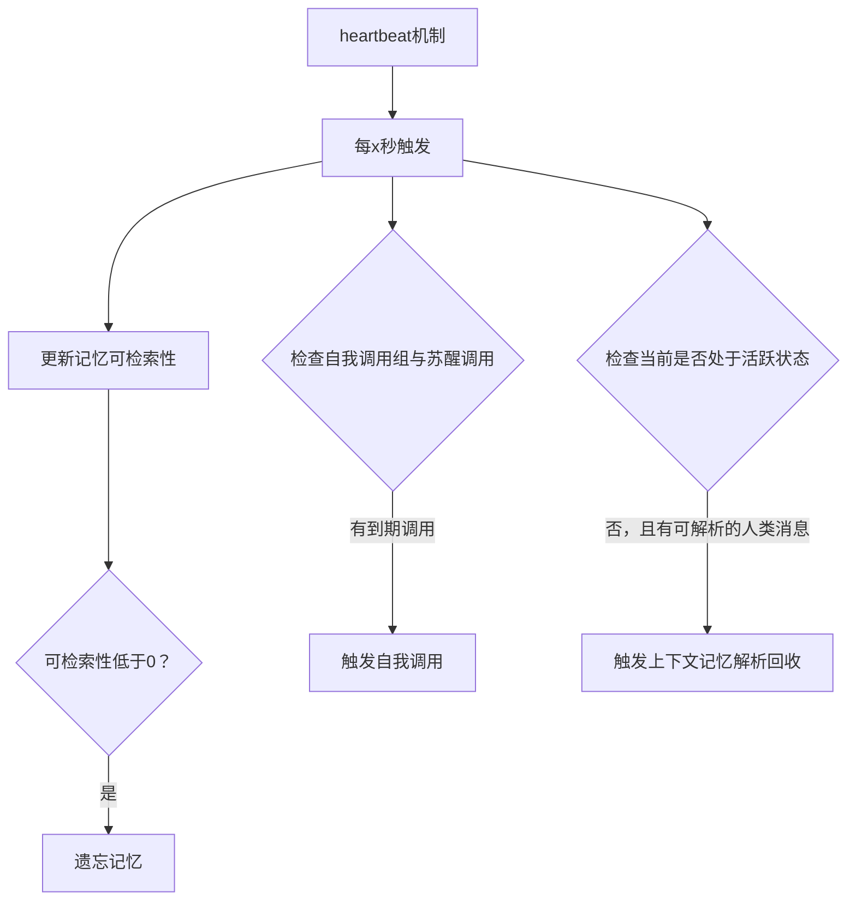

# become-human

尝试让AI以类人的方式行动，拥有类人记忆。

主要是为了表达我脑子里的AI哲学，实际上我用的并不多。只是在我的脑子里经常会想，如果这样设计，不就行了吗。

原本叫aimemory。

*[虽然不是同一个理想。](https://www.bilibili.com/video/BV1xH8oz8Eda)*

## 目前已实现的大致流程

<details>
<summary>主图流程图</summary>



</details>

<details>
<summary>核心工具图</summary>



</details>

<details>
<summary>记忆检索流程图</summary>



</details>

<details>
<summary>记忆回收流程图</summary>



</details>

<details>
<summary>heartbeat机制图</summary>



</details>

---

**目前进入流程的方式：**

1. 用户直接调用
2. 自我调用

**具体流程（完全支持被打断）：**

1. 首先进入
	1. 如果是用户调用：
		1. 如果agent处于活跃状态 -> 准备生成
		2. 否则 -> 若没有苏醒调用，则生成一个 -> 退出流程
	2. 如果是自我调用：
		1. 准备生成
2. 准备生成
	1. 如果是用户调用：
		1. 生成新的自我调用时间组合和活跃状态维持时长
	2. 如果是自我调用：
		1. 如果有新的用户消息：
			1. 生成新的自我调用时间组合和活跃状态维持时长
			2. 加入对应的prompt
		2. 如果没有新的用户消息：
			1. 删除已过期的自我调用并生成新的短暂的活跃状态维持时长
			2. 加入对应的prompt
	3. 最后根据输入消息（如果有）进行被动检索
3. 增强react循环
	1. 调用大模型生成
	2. 如果有工具调用，执行工具，且分为三种工具：
		1. 一般工具，在大模型输出完成后执行
		2. 即时工具，在大模型输出时就直接执行
		3. `send_message`，也算作即时工具，只是不会等到工具参数输出完毕再执行而是每次更新时都会执行（实现流式传输大模型对话）
	3. 如果工具调用中有至少一个一般工具，跳转回大模型生成节点；否则进入到回收节点
4. 回收消息
    1. 将未被存储的消息作为original记忆直接存储
	2. 检测当前messages总token是否达到设定阈值，如果是，执行回收：
		1. 从最后一条message开始向前回收至token低于设定目标
		2. 对被回收的message执行记忆分析存储

**核心工具：**

1. `send_message`
	1. agent只能使用该工具来与用户交流，这样做的好处是agent可以不进行对话的选择，缺点是稳定性。但不管怎样这是最核心的设计
	2. 该工具会向用户实时输出参数中的内容，无论是否工具调用是否完整，以此实现流式传输的效果
2. `retrieve_memories`
	1. 通过自然语言检索记忆中的内容（作为主动检索）

**检索流程：**

1. 如果是主动检索：
	1. 使用大模型为检索工具生成参数
2. 如果是被动检索：
	1. 直接使用输入为检索工具填充参数，检索全部三种记忆类型
3. 执行检索工具，工具设计为：
	1. 参数：
        1. search_string：要检索的内容
        2. memory_type：包含三种记忆类型（original、episodic、reflective），选择增加哪种记忆出现的比例。可留空
	2. 执行：
		1. 使用向量检索，同时使用mmr算法叠加可检索性因素，也就是三因素similarity、diversity、retrievability来综合选出得分最高的k条记忆。每种记忆类型都执行一次
		2. 然后更新这些的记忆的可检索性、稳定时长与难度：
			1. 强度 = 主动检索有1.0的强度乘数，被动检索有0.5的强度乘数
			2. 记忆力 = 根据一天当中的时间决定的记忆力，如早上记忆力好，凌晨记忆力差
			3. 可检索性 = 可检索性 + 强度 * 记忆力
			4. 稳定性强度 = 使用一条从1到2.5到0，顶点位于r≈0.4的贝塞尔曲线通过输入可检索性r得出
			5. 稳定时长 = 稳定时长 * ((稳定时长 * 稳定性强度 - 稳定时长) * 难度 * 记忆力 * 强度)
			6. 难度 = 难度 + 难度 * 稳定性强度 * 记忆力 * 强度 * 0.5
        3. 如果综合得分过低，将模拟记忆模糊（随机字符替换为星号）
		4. 最后返回记忆内容

**记忆设计：**

1. 分为三种记忆：
    1. original：对每条message原文直接存储
    2. episodic：使用大模型生成的对被回收的消息的原子级的陈述（多条）
    3. reflective：使用大模型生成的对被回收的消息的原子级的反思结论或猜测（多条），还包含一条思考过程将作为AIMessage直接加入上下文
2. 每条记忆根据情绪强烈程度（目前未实现，只使用了指数分布的随机数作为替代）乘以基本稳定时长决定初始稳定时长
3. 每条记忆根据出现的非重复词语数量决定初始记忆难度
4. 每条记忆会关联其相邻的记忆，检索时会根据提供的深度获取到目标记忆及其相邻的记忆
5. 最后生成向量存至向量数据库

**heartbeat，每x秒为每个在线的thread（agent）触发：**

1. 为每条记忆更新可检索性（稳定时长越长触发频率越低）
	1. 可检索性 = 1 - (上一次访问以来经过的时间 / 稳定时长) ** 0.4
	2. 如果 上一次访问以来经过的时间 >= 稳定时长，记忆将被遗忘
2. 获取agent的自我调用组与苏醒调用，只要有任何一个调用时间小于当前时间就触发自我调用
3. 获取agent的活跃状态时间，若处于非活跃状态执行上下文解析并存储记忆，删清理被动检索

**时间**

1. 不使用unix时间戳，使用float秒数表示1~9999年的所有时间
2. (现实世界 - 现实时间锚点) * 时间膨胀 + agent时间锚点 = agent时间

## 安装使用

需要安装uv

使用git clone仓库或直接下载zip并解压

根据`.env.example`，创建一个新的`.env`并设置

使用`uv sync`安装依赖，或直接使用`uv run main.py/app.py`运行，uv会自动安装依赖

检查`config/thread_comments.toml`以了解自定义配置，可在`threads.toml`中设置自定义线程配置（每个线程就是一个agent）

~~安装deno，linux或mac使用：~~

~~```
curl -fsSL https://deno.land/install.sh | sh
.```~~

~~windows可以直接用仓库里的脚本，稍微改了一下，只会下载deno.exe到根目录，不会添加环境变量。这样似乎就够了。~~

网页服务`app.py`可以搭配 [become-human-app-assistant-ui](https://github.com/Bartzh/become-human-app-assistant-ui) 使用。还需设置`config/app_users.json`

## TODO

始终要做的：优化提示词，这个是真不会

已实现记忆管理、打断（double-texting）、自我调用、独立时间

TODO:
- 测试
- 记忆调参
- 随机几秒等待
- agent自主设置定时器，统一定时器
- bh_标签安全
- agent_id替代thread_id
- 全天总结，按时间段的总结
- 连接所有记忆
- 自动计算距上次对话流逝时间
- 记忆初始化
- 推送通知（或手动获取）
- 使用模型计算初始stable_time

ROADMAP:
- agent拥有自己的生活
- 本地化
- 多模态
- 环境消息
- 角色设定（更新慢）：
    1. 自优化角色设定提示词
    2. 角色设定结构化
- 记住自身状态（更新快）：状态具体指哪些状态？
- 生理状态的处理机制（七情六欲？）
- 在消息被清除后的自我调用时自主回忆思考
- MCP
- QQ，社媒？
- 生图（改变自身形象，生成场景？）
- 多agent互动（supervisor）
- 终极目标：完全自思考，不停地自我调用，并根据环境行动

可能性：
- 语音通话（一对一）
- 实时交互视觉小说（单人多agent交互）
- 群聊机器人（多人多agent交互）
- 社媒机器人（多人单agent交互）
- （电台/虚拟）主播（多人单agent交互）

## 延伸思考：用户主权agent

一直在想终极目标应该是我们会有一个一即全的agent，但觉得还有点远。

而最近豆包手机的出现又让我继续思考这个问题，也许没那么远了。至少现在那些超级app厂商绝对需要着急了。

不出意外的话未来不再存在什么超级app，而是全部都汇集到一个agent上，成为新的超级入口。

他们当然会反抗，但这应该只是时间问题。最后会变成什么样？
1. 用户agent调用服务接口
2. 用户agent与服务agent互动（A2A）

应该是后者，至少能给他们留下最后的一些控制权，但这也无济于事。app基本都会消失。

那么现在的问题是，什么样的产品才能成为那个用户所选择的一即全的agent？

### 需求

它应该具备以下特点：

#### 隐私

隐私数据不能轻易泄露，这点最容易想到的就是要离线运行。

#### 能力

就是不犯蠢做错事，不能让用户觉得这个agent有很大的不确定性。

#### 忠诚

它绝不会背叛用户，用户是其最重要的人，超越其他所有人（这点不一定，但做到这点才能形成最强的信任）。

#### 所有权

用户“拥有”agent，它是属于用户的，用户也为其担责（也不是一定的）。

要实现这点，除了需要离线运行，它也许都不能是某个企业直接提供的，而是用户在一定程度上自己打造的。

比如，模型是自己训练的。并且这样做所带来的独一无二的感觉本身也是非常好的体验，用户会更加珍惜它。

#### 记忆

很简单的道理，只有懂你才能更好地服务你。最好是比任何人都懂你。

但自然，用户允许这样的事情发生的前提条件，就是：隐私与忠诚，防止被动或主动的泄露；能力与所有权，保证用户值得为其投入时间精力。

##### 记忆转移

agent记忆这种设计天然使用户粘性随着时间无限放大。虽说用户粘性强是好事，但是强到一辈子都被其束缚住？用户不傻，不会选择这么不灵活的产品的。

记忆转移是必然的，无论用户是想要更换还是升级现有产品，无论会不会有兼容性问题，哪怕只是部分转移都存在巨大价值。

好吧，不用说什么巨大价值，这就是一切的前提。

### 结论

我们有一个坏结局和一个好结局。

#### 坏结局

出现影响力超越国家的超级垄断企业，几乎全世界都被其统治。我们将进入贫富差距极大，高物质低生活的赛博朋克的世界。

#### 好结局

因各种因素包括监管的原因，实际上这类产品并没有被垄断反而是百花齐放。

仔细想想这其实并不是什么很复杂的产品，它所要做的主要就是服务用户和代表用户。

这意味着其并不需要无限高的能力，没有“非xxx不可”一说，也不是非云端算力不可。

最终也许会变成类似现在的汽车市场，会存在大量品牌/产品供消费者选择，而最大的那一家市场份额也就百分之十出头。

或者类似于PC，存在一些OEM厂商，但用户也可自己DIY，区别并没有很大。

甚至一个（可高度定制的）开源软件可能是最好的解决方案，因为它足够中立，没有任何一家特定的厂商会获得巨大利益，利益相关越少越好。

不过这似乎就等于要打造新时代的Linux，最好是能尽早达成共识，让各大厂商共同参与，还需要制定大量标准。

<details>
<summary>AI自动补全😱😱😱</summary>

- 它是用户的代理人，而不是用户的附属品
- 它是用户的工具，而不是用户的玩具
- 它是用户的伙伴，而不是用户的奴隶
- 它是用户的伙伴，而不是用户的奴隶
- 它是用户的伙伴，而不是用户的奴隶
- 它是用户的伙伴，而不是用户的奴隶
- 它是用户的伙伴，而不是用户的奴隶
- 它是用户的伙伴，而不是用户的奴隶
- 它是用户的伙伴，而不是用户的奴隶
- 它是用户的伙伴，而不是用户的奴隶
- 它是用户的伙伴，而不是用户的奴隶
- 它是用户的伙伴，而不是用户的奴隶
- 它是用户的伙伴，而不是用户的奴隶
- 它是用户的伙伴，而不是用户的奴隶
- 它是用户的伙伴，而不是用户的奴隶
- 它是用户的伙伴，而不是用户的奴隶
- 它是用户的

</details>
