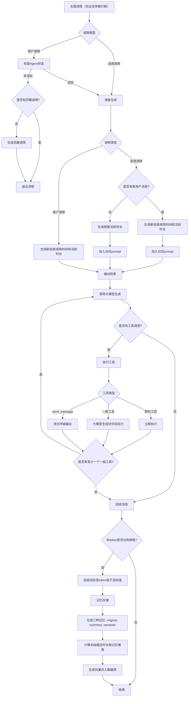
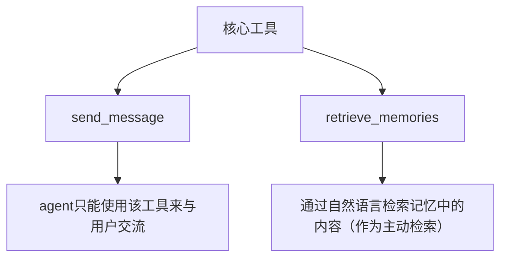
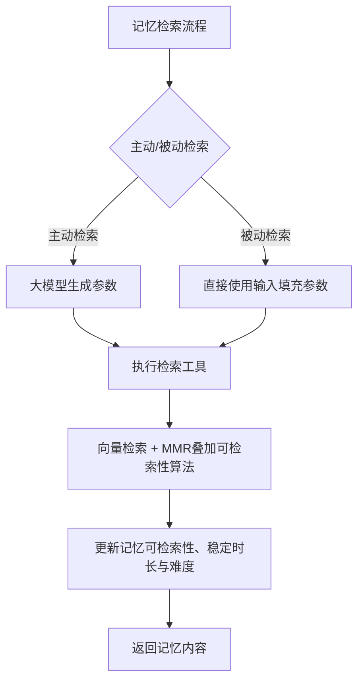
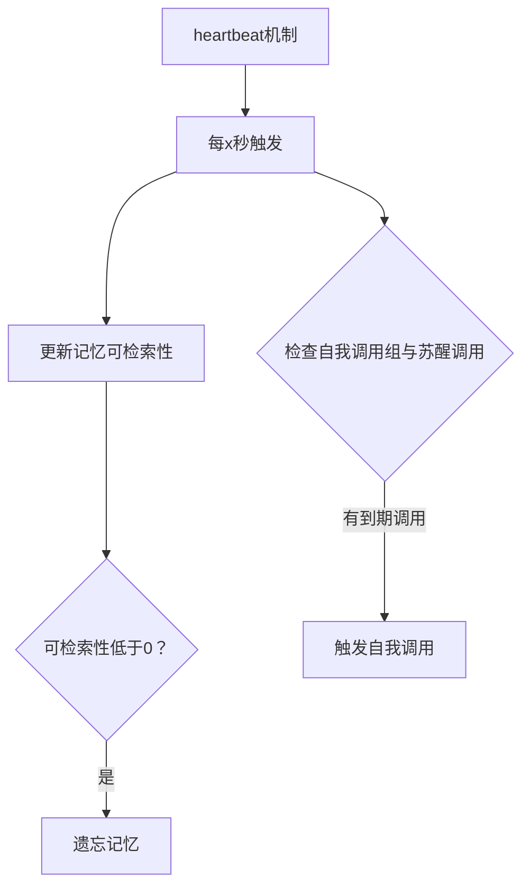

# become-human

尝试让AI以类人的方式行动，拥有类人记忆。

原本叫aimemory。

**[虽然不是同一个理想。](https://www.bilibili.com/video/BV1xH8oz8Eda)**

## 目前已实现的大致流程

<details>
<summary>主图流程图</summary>



</details>

<details>
<summary>核心工具图</summary>



</details>

<details>
<summary>记忆检索流程图</summary>



</details>

<details>
<summary>heartbeat机制图</summary>



</details>

---

**目前进入流程的方式：**

1. 用户直接调用
2. 自我调用

**具体流程（完全支持被打断）：**

1. 首先进入
	1. 如果是用户调用：
		1. 如果agent处于活跃状态 -> 准备生成
		2. 否则 -> 若没有苏醒调用，则生成一个 -> 退出流程
	2. 如果是自我调用：
		1. 准备生成
2. 准备生成
	1. 如果是用户调用：
		1. 生成新的自我调用时间组合和活跃状态维持时长
	2. 如果是自我调用：
		1. 如果有新的用户消息：
			1. 生成新的自我调用时间组合和活跃状态维持时长
			2. 加入对应的prompt
		2. 如果没有新的用户消息：
			1. 删除已过期的自我调用并生成新的短暂的活跃状态维持时长
			2. 加入对应的prompt
	3. 最后根据输入消息（如果有）进行被动检索
3. 增强react循环
	1. 调用大模型生成
	2. 如果有工具调用，执行工具，且分为三种工具：
		1. 一般工具，在大模型输出完成后执行
		2. 即时工具，在大模型输出时就直接执行
		3. `send_message`，也算作即时工具，只是不会等到工具参数输出完毕再执行而是每次更新时都会执行（实现流式传输大模型对话）
	3. 如果工具调用中有至少一个一般工具，跳转回大模型生成节点；否则进入到回收节点
4. 回收消息
	1. 检测当前messages总token是否达到设定阈值，如果是，执行回收：
		1. 从最后一条message开始向前回收至token低于设定目标
		2. 对被回收的message执行记忆存储，分为三种记忆：
			1. original：对每条message原文直接存储
			2. summary：使用大模型生成对这些被回收的消息的总结
			3. semantic：使用大模型生成对这些被回收的消息的简短的、原子性的语义信息（多条）
		3. 每条记忆根据情绪强烈程度（目前未实现，只使用了随机数作为替代）乘以基本稳定时长决定初始稳定时长
		4. 每条记忆根据出现的非重复词语数量决定初始记忆难度
		5. 最后生成向量存进向量数据库

**核心工具：**

1. `send_message`
	1. agent只能使用该工具来与用户交流，这样做的好处是agent可以不进行对话的选择，缺点是稳定性。但不管怎样这是最核心的设计
	2. 该工具会向用户实时输出参数中的内容，无论是否工具调用是否完整，以此实现流式传输的效果
2. `retrieve_memories`
	1. 通过自然语言检索记忆中的内容（作为主动检索）

**检索流程：**

1. 如果是主动检索：
	1. 使用大模型为检索工具生成参数
2. 如果是被动检索：
	1. 直接使用输入为检索工具填充参数，检索全部三种记忆类型
3. 执行检索工具，工具设计为：
	1. 参数：
		1. 参数包含三种记忆类型（original、summary、semantic）的可选的输入，输入内容包含：
			1. search_string：要检索的内容
			2. create_time_range：限定检索结果时间范围
		2. 两个参数皆为可选，如果只有create_time_range则会直接获取指定时间范围内的记忆而不使用向量检索
		3. 三种记忆类型的参数独立区分且都是可选，这意味着可以控制要检索的记忆类型与专门设计的检索语句。但将不想检索的记忆留空并不会完全去掉该类型记忆的检索，只会降低其在最终结果中的比例
	2. 执行：
		1. 使用向量检索，同时使用mmr算法叠加可检索性因素，也就是三因素similarity、retrievability、diversity来综合选出得分最高的k条记忆。每种记忆类型都执行一次
		2. 然后更新这些的记忆的可检索性、稳定时长与难度：
			1. 强度 = 主动检索有1.0的强度乘数，被动检索有0.5的强度乘数
			2. 记忆力 = 根据一天当中的时间决定的记忆力，如早上记忆力好，凌晨记忆力差
			3. 可检索性 = 可检索性 + 1 * 记忆力 * 强度
			4. 稳定性强度 = 使用一条从1到2.5到0，顶点位于r≈0.4的贝塞尔曲线通过输入可检索性得出
			5. 稳定时长 = 稳定时长 * ((稳定时长 * 稳定性强度 - 稳定时长) * 难度 * 记忆力 * 强度)
			6. 难度 = 难度 + 难度 * 稳定性强度 * 记忆力 * 强度 * 0.5
		3. 最后返回记忆内容

**heartbeat，每x秒为每个在线的thread（agent）触发：**

1. 为每条记忆更新可检索性（稳定时长越长触发频率越低）
	1. 可检索性 = 1 - (上一次访问以来经过的时间 / 稳定时长) ** 0.4
	2. 如果 上一次访问以来经过的时间 >= 稳定时长，记忆将被遗忘
2. 获取agent的自我调用组与苏醒调用，只要有任何一个调用时间小于当前时间就触发自我调用

## 安装使用

clone仓库或直接下载zip。

使用`uv sync`

设置`.env`

安装deno，linux或mac使用：

```
curl -fsSL https://deno.land/install.sh | sh
```

windows可以直接用仓库里的脚本，稍微改了一下，只会下载deno.exe到根目录，不会添加环境变量。这样似乎就够了。

`uv run main.py/app.py`即可，或直接进入虚拟环境

网页服务`app.py`可以搭配 [become-human-app-assistant-ui](https://github.com/Bartzh/become-human-app-assistant-ui) 使用。
还需设置`config/app_users.json`

---

始终要做的：优化提示词，这个是真不会

已实现记忆管理（如果用RWKV会如何？）、打断（double-texting）、自我调用

TODO:
- 显示时间
- 推送通知（或手动获取）
- 目前的回收机制有问题，太滞后
- agent自己的时间，自己的时区，自己的时间膨胀
- 使用模型计算初始stable_time

ROADMAP:
- 多模态
- 环境消息
- 角色设定（更新慢）：
    1. 自优化角色设定提示词
    2. 角色设定结构化
- 记住自身状态（更新快）：状态具体指哪些状态？
- 生理状态的处理机制（七情六欲？）
- MCP
- 多agent互动（supervisor）
- 终极目标：完全自思考，不停地自我调用，并根据环境行动
